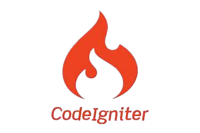

# Praktikum 7 - 11: PHP Framework (CodeIgniter 4) & Vuejs

 
 
 
 
 

Dokumentasi ini berisi rangkuman materi dan latihan dalam **Praktikum 7-11** dari mata kuliah **Pemorograman Web 2**.  
---

## 👤 Profil Mahasiswa

| Variable           | Isi                         |
| ------------------ | --------------------------- |
| **Nama**           | Raditra Ikhwanul Arifin     |
| **NIM**            | 312310487                   |
| **Kelas**          | TI.23.A.5                   |
| **Mata Kuliah**    | Pemrograman Web 2           |
| **Dosen Pengampu** | Agung Nugroho S.kom., M.kom |

---

## 🌐 Link Demo Online

Berikut adalah link Website live dari proyek Web Artikel menggunakan **CodeIgniter 4** dan **VueJS** sebagai frontend-nya:

| **Aplikasi**        | **URL**                                                                                                              | **Deskripsi**                             |
| ------------------- | -------------------------------------------------------------------------------------------------------------------- | ----------------------------------------- |
| **Web Artikel CI4** | [https://raditra.infinityfreeapp.com/](https://raditra.infinityfreeapp.com/)                       | Aplikasi web artikel dengan CodeIgniter 4 |
| **VueJS Frontend**  | [https://raditra.infinityfreeapp.com/lab8_vuejs/](https://raditra.infinityfreeapp.com/lab8_vuejs/) | Frontend VueJS untuk konsumsi REST API    |

> ⚙️ Backend dibangun dengan CodeIgniter 4 sebagai REST API.  
> 🎨 Frontend dibangun menggunakan VueJS yang mengonsumsi API dari backend.

